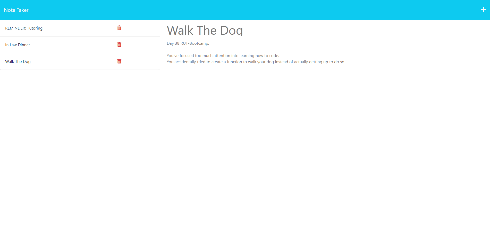

# **Note Taker**

  ## **Description**
  - Simply add notes with a title and body of information that you can store 

  - This application taught me much more about inquirers, and how we can use constructors on a more broadened spectrum.

  - []

  ## Table of Contents
  - [Installation](#installation)
  - [Usage](#usage)
  - [Contribution](#contribution)
  - [Testing](#testing)
  - [MIT](https://opensource.org/licenses/MIT)
  - [Questions](#questions)

  ---

  ## **Installation**
  To install, please download the folder/repository through the github url above.

  ---

  ## **Usage Information**
  Start by clicking on the 'Get Started' button upon loading the page.
  Next, you'll want to add a Title to your note, followed by a body of information that would pertain to your note(s) within the 'Note Text' section.
  Once your note looks good and complete, click on the save icon in the top right of your browser, and it'll save that note on the left-hand side for you to revisit when you need to.

  ---
  
  ## **Contribution**
  This is an open source project. If you'd like to contribute, simply create a pull request.

  ---

  ## **Testing**
  Within the terminal type in 'npm start'.
  From there, make your way to your browser and type in 'localhost:3000' as your url.

  ---

  
   ## **License**
  License: MIT

  For more information on the license above, please go to [https://www.choosealicense.com/](https://www.choosealicense.com/).

  ---

  ## **Questions**
  If you have any questions about this repository, please contact me directly at [zachhsavage@gmail.com](mailto:zachhsavage@gmail.com).
  You can find this repository, and others I have worked on at [Animeet](https://www.github.com/Animeet).
